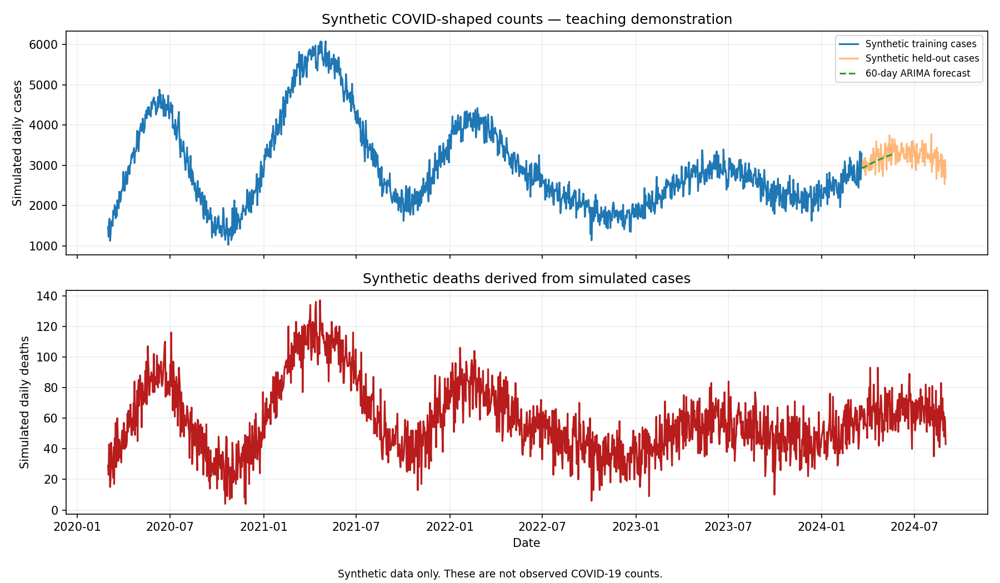
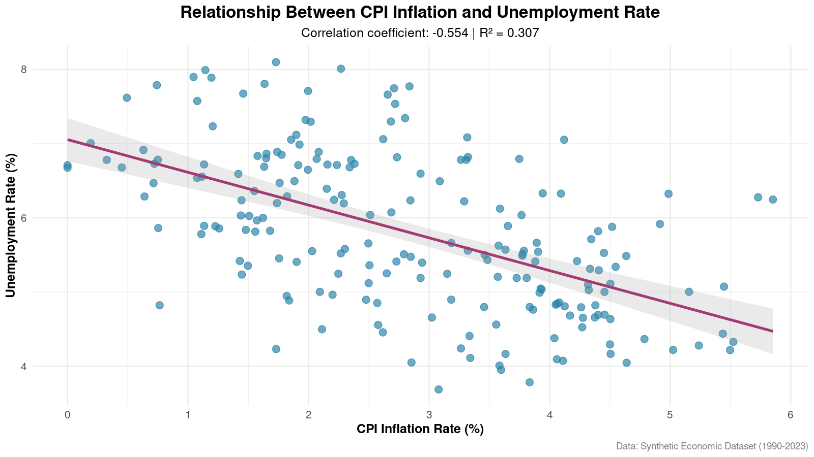
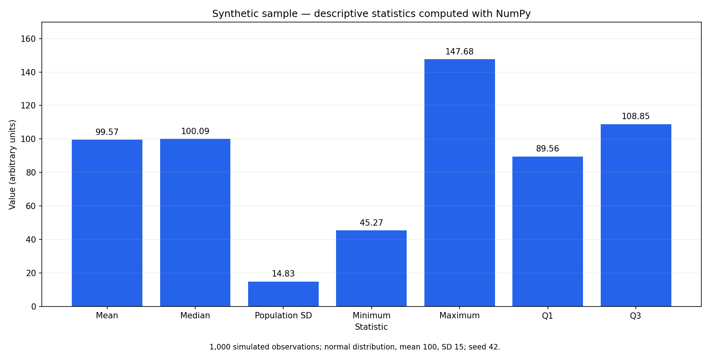

# Statistical demonstration portfolio

This summary describes the executable examples currently included in this
repository. All three use synthetic data. They demonstrate methods, not
findings about real populations, epidemics or economies.

## 1. Synthetic time-series forecasting — Python

[Run the Python script](../code/generate_portfolio_visualizations.py) to generate
daily counts from March 2020 to August 2024 using a fixed seed, a trend, seasonal
variation and artificial waves. Synthetic deaths are derived from the simulated
cases and noise.

An ARIMA(2, 1, 2) model fits the first 90% of the cases. Its next 60 predictions
are compared with held-out synthetic observations using MAE and RMSE. These
metrics are saved to `assets/images/demo_metrics.json`; they are not estimates
of real-world forecasting accuracy. The model order is an illustrative choice,
not the result of a model-selection study.

## 2. Synthetic economic regression — R

[Run the R script](../code/econ_analysis.R) to generate 200 synthetic inflation
and unemployment observations with seed 42. The example computes Pearson
correlation and fits `unemployment_rate ~ cpi_inflation`. The plot shows the
regression line and confidence band; generated input data are saved as CSV.

The year values span 1990–2023 continuously; they are not monthly observations
or a downloaded FRED dataset. The example does not establish a causal effect.

## 3. Descriptive statistics — Python/NumPy

The Python script generates 1,000 normally distributed observations and plots
the mean, median, population standard deviation, minimum, maximum and quartiles.
The values are computed by NumPy, not by Java or Apache Commons Math.

## Reproduction and limitations

Installation and commands are in [README.md](../../README.md). A fixed seed
makes the examples repeatable within a given software environment, while
numerical results can vary slightly between versions/platforms. Synthetic data
and supplied figures are teaching examples. External datasets and earlier
claims of real-world findings are not part of this executable workflow.

The previous PDF and screenshot illustrations are historical assets and are
not the current project report. This document supersedes that report.
